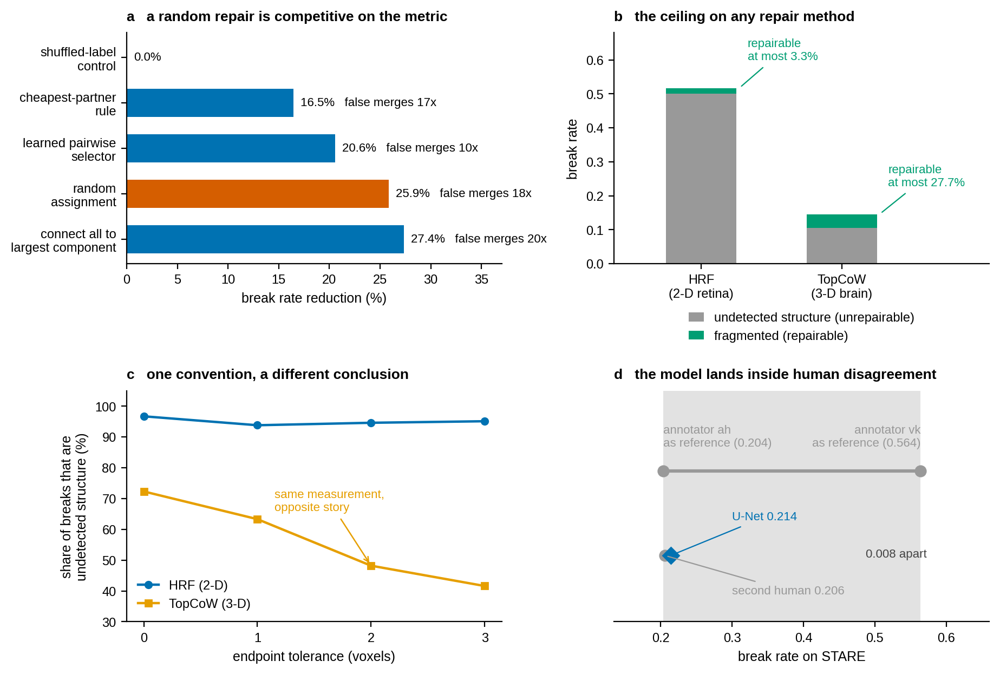
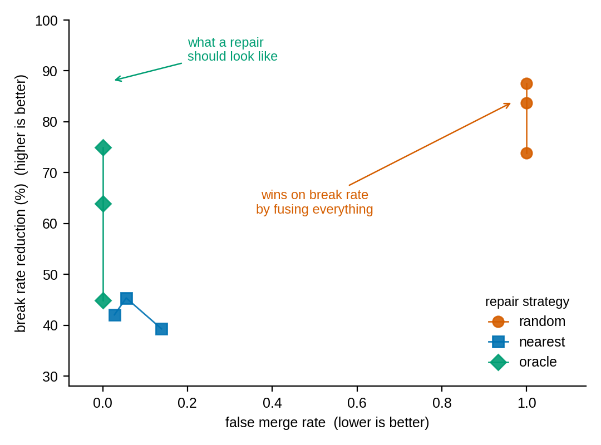

# topocheck

Sanity checks for claims about **topology-aware segmentation** — the losses,
decoders and repair methods that promise fewer broken vessels, airways, neurons
or roads.

[](https://github.com/GuoCheng24/topocheck/actions/workflows/ci.yml)
[](LICENSE)
[](pyproject.toml)

Connectivity metrics are unusually easy to move for the wrong reasons. Each check
here exists because it caught a result that looked publishable and was not.



*(a)* On TopCoW, a **random** assignment of fragments reduced the break rate by
25.9% — ahead of every learned repair we built, and 1.5 points behind simply
connecting everything to the largest component. All of them multiply false merges
by 10-20x, which is the only reason they are distinguishable at all.
*(b)* The fragmented share of the errors is a hard ceiling on any repair method:
3.3% on HRF against 27.7% on TopCoW, an 8.4-fold difference in how much a decoder
could possibly buy. *(c)* Allowing endpoints to match within 2 voxels leaves HRF's
undetected share essentially unchanged (96.7% to 94.6%) and cuts TopCoW's by a
third (72.3% to 48.2%) — the same measurement telling two different stories.
*(d)* A U-Net cross-validated against one STARE annotator lands 0.008 from where
the second human annotator lands, inside the gap between the two humans.
Regenerate with `python examples/make_hero_figure.py`.

## Install

```bash
pip install git+https://github.com/GuoCheng24/topocheck
```

Requires numpy, scipy and scikit-image. Not yet on PyPI.

## Thirty seconds

```bash
python examples/quickstart.py
```

builds a synthetic vessel tree, breaks it in two different ways, applies a
deliberately useless "repair", and asks the checks whether to believe it:

```
ground truth decomposes into 7 branches

[1] how much of the error is repairable at all
    break 0.286 = missing 0.143 + fragmented 0.143
    a repair method can remove at most 50% of the breaks

[2] does a proposed repair beat a random one of the same size
    added 36 voxels
    break: 0.286 -> 0.286 (random of equal size: 0.143)
    beats random: False
```

In your own code:

```python
import topocheck as tc

units = tc.build_units(gt)                          # GT branch decomposition, 2-D or 3-D
tc.decompose_errors(pred, units)                    # how much of the error is even repairable?
tc.random_repair_baseline(pred, repaired, units)    # does your repair beat a random one?
tc.tolerance_sweep(pred, units)                     # does the conclusion survive the conventions?
tc.annotation_floor(gt_observer1, gt_observer2)     # is the gain inside human disagreement?
tc.prevalence_check(y, scores, prevalence=1e-3)     # does a balanced AUC survive deployment?
```

## The five checks, and why each one exists

### 1. `random_repair_baseline` — does your repair beat a random one?

Connectivity metrics reward *adding voxels*: link anything to anything and
endpoints become co-connected. On TopCoW (3-D cerebrovascular, 50 held-out
cases), a **random** assignment of fragments to components reduced the break rate
by **25.9%** — beating every learned repair we had built (best: 20.6%) and
landing within a point of the crude "connect every fragment to the largest
component" rule (**27.4%**). Both blew up false merges by 17–20x, which is the
only reason the difference is visible at all.

A method that does not clearly beat a random repair *of the same size*, at
matched false-merge cost, has not been shown to repair anything. Report both.

### 2. `decompose_errors` — how much of the error is even repairable?

Split connectivity failures into

* **missing** — an endpoint is in no predicted component at all: the structure
  was never detected, and no decoder can recover it;
* **fragment** — both endpoints detected but in different components: this is
  the part a repair could fix.

`fragment / break` is then a hard upper bound on any repair method, and in our
data it was **not** a loose bound: on the 50 TopCoW held-out volumes an oracle
repair captured **27.36%** against a predicted budget of **27.4%**, with a
per-case Spearman correlation of **1.000** between a case's budget and its
realised gain, and **0/50** cases exceeding their own budget.

Measure this before building the method. On HRF (2-D retinal fundus) the
repairable share was only **1.8–3.3%** across four training objectives, which
caps that entire family of methods at a few percent no matter how clever the
decoder is.

### 3. `tolerance_sweep` — does the conclusion survive the metric's conventions?

Requiring the exact ground-truth endpoint voxel to lie inside a predicted
component is one convention among several. Relaxing it to "within 2 voxels"
changed TopCoW from *72.3% of errors are undetected structure* to *48.2%*, and
cut the break rate from 0.146 to 0.095 (**-34.6%**) — while the same relaxation
moved HRF almost not at all (undetected share stayed within **93.8–98.2%** over
tolerances 0–3, on two different training objectives).

If your error composition moves under the sweep, the metric cannot on its own
carry a claim about *why* the errors happen. Report the sweep, not one setting.

### 4. `annotation_floor` — is the improvement inside human disagreement?

Evaluate the metric between two independent annotations of the same images. On
STARE (20 retinal fundus images, two expert annotators) the break rate between
them was **0.204** in one direction and **0.564** in the other, and **99.4%** of
that disagreement was *structure one annotator drew and the other did not* — not
fragmentation.

A U-Net cross-validated on the same 20 images against annotator `ah` reached a
break rate of **0.214** where the second human scored **0.206**, while scoring
higher on both Dice (0.775 vs 0.740) and clDice (0.845 vs 0.715). A model can fit
one annotator's inclusion convention about as well as another expert does, which
is worth knowing before reading a 30% improvement as 30% better topology.
(Model-vs-human numbers are field-of-view masked, hence 0.206 rather than 0.204.)

The direction matters: a more inclusive annotator scores very differently as
reference than as prediction. Both are reported.

### 5. `prevalence_check` — does a balanced-sample AUC survive deployment?

Discriminative power measured on a 1:1 sample says little when positives are
rare. On TopCoW, a classifier separating missed-vessel voxels from background
using only local image statistics reached **AUC 0.971** on balanced samples
(label-shuffled control: 0.505). Deployed at the real class ratio it needed a
**12.2x** increase in false structure to buy a 15.6% break reduction, and was
beaten at every operating point by simply ranking the same voxels by the
segmentation network's own probability (13.1% break reduction at 6.7x).

This check turns an AUC into the precision, and the false-positives-per-true,
that you would actually operate at. A zero false-positive count in a finite
sample is reported as a rule-of-three bound rather than a precision of 1.0.

## Reproducing the phenomenon

The headline observation — a random repair scoring well — is not a property of
those datasets. `examples/why_random_wins.py` builds synthetic vasculature,
fragments it, and repairs it three ways: at random, by nearest component, and by
the true partner. It takes about a minute and downloads nothing.



Across fragmentation levels, the strategy that scores **best** on break rate is
the random one, because fusing everything makes every pair of endpoints
co-connected. It is only on the second axis that it is revealed as a collapse
rather than a repair. This is why `random_repair_baseline` reports both when you
pass it the ground truth.

For how each number quoted above was produced, and what cannot be checked from
this repository, see [docs/EVIDENCE.md](docs/EVIDENCE.md).

## What this does not claim

* It does **not** say topology-aware losses do not work. Several of them clearly
  do; the point is that the size of the effect is easy to overstate and these are
  the specific ways it happens.
* It does **not** provide a better repair method. It provides the floor and the
  ceiling that one would have to beat.
* The checks are domain-agnostic; **the numbers are not**. Every figure quoted
  above comes from public datasets, with a plain U-Net and standard
  topology-aware losses: **HRF** (2-D retinal fundus, 45 images), **STARE** (2-D
  retinal fundus, 20 images, two annotators), **TopCoW** (3-D cerebrovascular,
  50 held-out cases plus external centres from ISLES, Lausanne and IXI) and
  **MSD Task08 Hepatic Vessel** (3-D). No private or patient-identifiable data is
  involved.

## Implementation notes

* Units are **open branches** of the ground-truth skeleton: junctions are removed
  and only pieces with exactly two endpoints are kept. Under full connectivity,
  removing a junction also removes its immediate neighbours, so very short stubs
  do not survive; this is pinned by a test.
* Full connectivity (8-neighbour in 2-D, 26 in 3-D) is used for the foreground
  throughout, which avoids the foreground/background connectivity paradox for
  thin structures.
* `random_repair_baseline` matches the *number of voxels added*, a deliberately
  crude proxy for "amount of intervention". Its purpose is to establish a floor,
  not to compete.
* A zero false-positive count in a finite sample is reported as a rule-of-three
  bound rather than a precision of 1.0.

## Related work

The methods these checks are aimed at:

* Shit et al., *clDice: a novel topology-preserving loss function for tubular
  structure segmentation* ([arXiv:2003.07311](https://arxiv.org/abs/2003.07311))
* Kirchhoff et al., *Skeleton Recall Loss for connectivity conserving and
  resource efficient segmentation of thin tubular structures*
  ([arXiv:2404.03010](https://arxiv.org/abs/2404.03010))
* *Efficient connectivity-preserving instance segmentation with a supervoxel-based
  loss function* ([arXiv:2501.01022](https://arxiv.org/abs/2501.01022))
* Stucki et al., *Topograph: an efficient graph-based framework for strictly
  topology preserving image segmentation*
  ([arXiv:2411.03228](https://arxiv.org/abs/2411.03228))

The closest work in spirit, and complementary to this one — it examines how the
metrics are computed (connectivity choice, ground-truth artefacts, metric
aggregation), where these checks examine what a reported improvement can be
attributed to:

* Berger, Lux, Weers, Menten, Rueckert and Paetzold, *Pitfalls of topology-aware
  image segmentation*, IPMI 2025
  ([arXiv:2412.14619](https://arxiv.org/abs/2412.14619))

## Where help is wanted

Concrete and in order of usefulness:

1. **A counterexample.** A domain where the repairable share is large *and* a
   repair method beats the random baseline at matched false-merge cost. We did
   not find one across 2-D retina, 3-D cerebrovascular and 3-D hepatic vessels,
   and we would rather be shown wrong than keep saying so.
2. **More annotation floors.** Any dataset with two or more independent
   annotations of the same images. The floor is cheap to measure and almost never
   reported, and it decides whether a benchmark has room left.
3. **The decomposition for other structural metrics.** The missing/fragmented
   split is defined here for endpoint connectivity; the same argument should
   apply to Betti-number error, variation of information, and split/merge counts,
   but the bookkeeping differs.

Contribution guidelines and what qualifies as a check: [CONTRIBUTING.md](CONTRIBUTING.md).

## Citing

See [CITATION.cff](CITATION.cff).

## License

MIT
